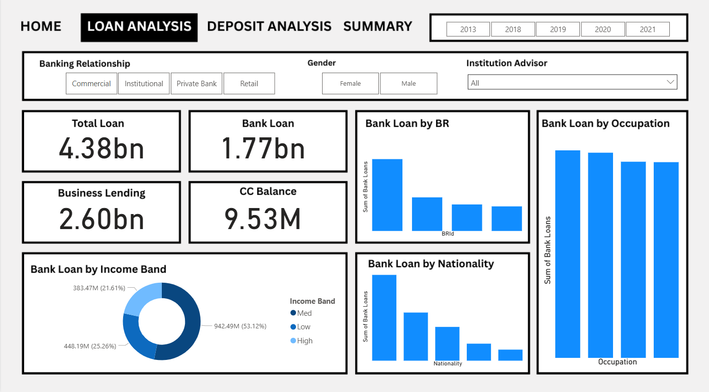
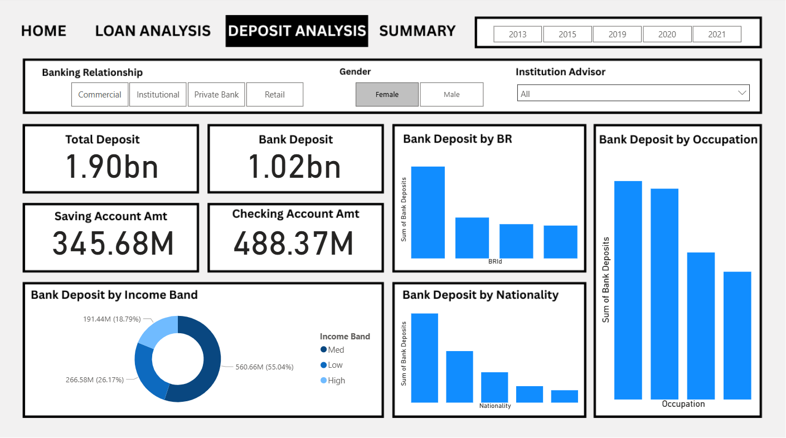
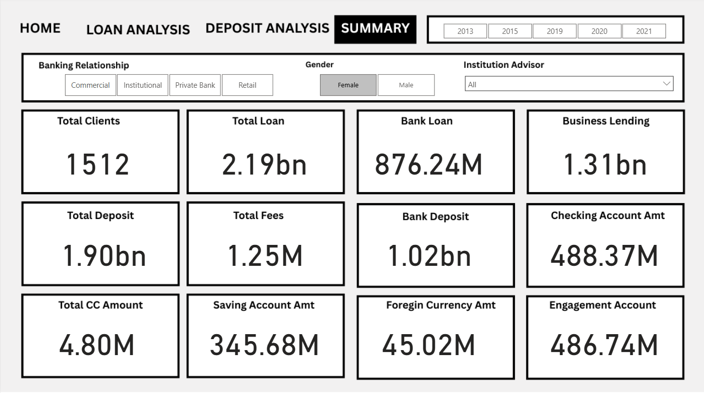

# 🏦 Banking Dashboard

## 1. Project Title / Headline
💡 **Smart Banking Insights: Data-Driven Financial Dashboard**

An interactive Power BI dashboard built to analyze and visualize customer transactions, account distribution, and fee revenues — powered by Python for preprocessing, MySQL for data storage, and Power BI for analytics.

---

## 2. Short Description / Purpose
The **Banking Dashboard** provides a complete overview of customer account activities, transaction volumes, and engagement metrics.  
It helps financial analysts and management teams make data-driven decisions regarding profitability, customer engagement, and service optimization.

---

## 3. Tech Stack
The dashboard was built using the following tools and technologies: 
• 🐍 **Python (Pandas, Matplotlib)** – Data cleaning and preprocessing.  
• 🗃️ **MySQL** – Data storage and management for transaction and customer records.  
• 📊 **Power BI Desktop** – Data visualization and reporting.  
• ⚙️ **Power Query** – Data transformation layer inside Power BI.  
• 🧮 **DAX (Data Analysis Expressions)** – Custom calculations (e.g., Total Fee, Engagement Accounts).  
• 📁 **File Format** – `.pbix` for dashboard, `.sql` for database, `.csv` for raw data.  

---

## 4. Data Source
**Source:** Internal bank dataset (sample or simulated data).  
It includes tables such as:
- **Customers:** Basic customer information.  
- **Accounts:** Account types, balances, and engagement details.  
- **Transactions:** Deposits, withdrawals, and fees.  

Data was imported from MySQL into Power BI via direct query and transformed using Power Query.

---

## 5. Features / Highlights

### • Business Problem
Banks generate large volumes of transaction and customer data but often lack an intuitive, visual way to monitor account activity, revenue generation, and engagement levels in real time.

### • Goal of the Dashboard
To build a visual analytics solution that:
- Tracks total fees and engagement accounts.
- Identifies top-performing account types.
- Provides actionable insights for management decisions.

### • Walkthrough of Key Visuals
- **KPIs (Top Section):**
  - Total Accounts  
  - Total Engagement Accounts  
  - Total Fees Collected  
  - Average Balance per Account  

- **Account Distribution by Type (Bar Chart):**  
  Displays how many customers use Savings, Current, or Engagement accounts.

- **Monthly Fee Trend (Line Chart):**  
  Shows revenue pattern from account fees over time.

- **Customer Engagement Ratio (Donut Chart):**  
  Shows percentage of customers with Engagement accounts.

- **Regional Branch Performance (Map or Bar Chart):**  
  Compares fee income and active customers by region.

- **Customer Balance Analysis (Scatter Chart):**  
  Helps identify high-value customers vs. low-engagement ones.

### • Business Impact & Insights
- **Profitability Tracking:** Identify which account types generate the most revenue.  
- **Customer Retention:** Spot high-engagement customer groups.  
- **Operational Strategy:** Allocate resources to branches or regions driving higher income.  
- **Decision Support:** Empower financial analysts with real-time visual insights.

---

## 6. Screenshots / Demos

### 📊 Dashboard Previews

---

## 7. Folder Structure

